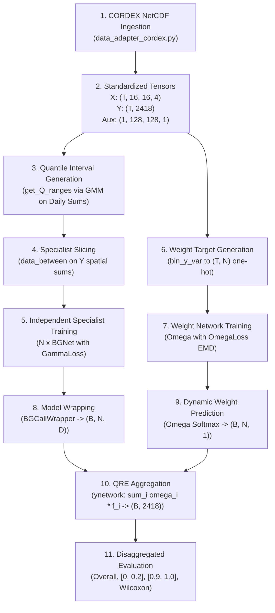

# Phase 12: Experiment Implementation Audit Report

**Project**: Quantile-Regression-Ensemble (QRE) Reproduction (AAAI 2024)  
**Date**: September 16, 2026  
**Primary Reference**: AAAI 2024 Paper *"Quantile-Regression-Ensemble: A Deep Learning Algorithm for Downscaling Extreme Precipitation"*  
**Secondary Reference**: Official Repository Implementation (`C:\BTP`)  
**Target Dataset**: CORDEX-ML-Bench (New Zealand Domain, ACCESS-CM2 Simulation)  

---

## 1. Executive Summary

This audit establishes the comprehensive technical verification of the QRE software pipeline in preparation for real-data experiments on CORDEX-ML-Bench. It traces the full execution pipeline from raw NetCDF ingestion to evaluation, evaluates all algorithmic components against the published paper, audits edge cases in GMM quantile partitioning, early stopping, randomness seeding, baseline models, elevation handling, and defines the exact code changes and experiment runner interface.

> [!IMPORTANT]
> **NO TRAINING PERFORMED**: In accordance with instructions, no neural networks were trained, no 40-repetition loops were executed, `run.py` was not modified, and no scientific algorithms were altered during Phase 12.

---

## 2. Current QRE Execution Flow

The exact step-by-step pipeline execution flow from CORDEX ingestion to evaluation:



### Stage-by-Stage Component Audit Table:

| Pipeline Stage | Module / Function | Input Shape | Output Shape | Paper Correspondence | Status with CORDEX |
| :--- | :--- | :--- | :--- | :--- | :--- |
| **1. Data Ingestion** | `data_adapter_cordex.py` $\to$ `load_cordex_dataset` | NetCDF files on disk | $X: (T, 16, 16, 4)$, $Y: (T, 2418)$ | Section 4.1 (Predictor/Predictand) | **CONFIRMED** |
| **2. Quantile Slicing** | `run.py` $\to$ `get_Q_ranges(y, N)` | $Y: (T, 2418)$ | $N$ interval tuples $[(q_{i-1}, q_i)]$ | Section 4.2 (GMM on spatial sums) | **CONFIRMED** |
| **3. Specialist Slicing** | `useful_functions.py` $\to$ `data_between` | $Y, X, q_{\text{low}}, q_{\text{high}}$ | $X_q: (T_q, 16, 16, 4)$, $Y_q: (T_q, 2418)$ | Section 4.2 (Sub-regime partitioning) | **CONFIRMED** |
| **4. Specialist Training** | `ConvolutionalNetworks.py` (`BGNet`), `GammaLoss.py` | $X_q, Y_q$ | Trained `BGNet` weights | Section 3 & 4.2 (BGNet + GammaLoss) | **CONFIRMED** |
| **5. Weight Target Gen** | `quantiles.py` $\to$ `bin_y_var` | $Y: (T, 2418)$, $Q_{\text{ranges}}$ | $Y_\omega: (T, N)$ one-hot | Section 4.2 (Discrete classification) | **CONFIRMED** |
| **6. Weight Network Train**| `quantiles.py` (`Omega`, `OmegaLoss`) | $X: (T, 16, 16, 4)$, $Y_\omega: (T, N)$ | Trained `Omega` weights | Section 4.2 (EMD Wasserstein Loss) | **CONFIRMED** |
| **7. Wrapper Inference** | `ConvolutionalNetworks.py` (`BGCallWrapper`) | $X_{\text{test}}: (B, 16, 16, 4)$ | $f_i(x): (B, 2418)$ expected rain | Section 3 / Eq. 2 ($p \cdot \frac{\alpha}{\beta}$) | **CONFIRMED** |
| **8. Dynamic Weights** | `quantiles.py` (`Omega(x)`) | $X_{\text{test}}: (B, 16, 16, 4)$ | $\omega(x): (B, N)$ simplex weights | Section 4.2 / Eq. 4 ($\text{Softmax}$) | **CONFIRMED** |
| **9. Ensemble Aggregation**| `quantiles.py` (`ynetwork`) | $f(x): (B, N, D)$, $\omega(x): (B, N, 1)$ | $g(x): (B, 2418)$ | Section 4.2 / Eq. 4 ($\sum \omega_i f_i$) | **CONFIRMED** |
| **10. Evaluation** | `useful_functions.py` (`collect_metrics`) | $Y_{\text{test}}, g(X_{\text{test}})$ | MSE tables + Wilcoxon $p$-values | Section 5 (Table 1 & 2) | **ADAPTATION REQ.** |

---

## 3. Quantile Generation Audit (`get_Q_ranges`)

### Paper Methodology vs Repository Code:
- **Spatial Sum Aggregation**: **[CONFIRMED]** The repository computes $\sum_d Y_{t, d}$ via `np.sum(y_train, axis=-1)` which correctly pools spatial rainfall intensity.
- **Gaussian Mixture Clustering**: **[CONFIRMED]** Fits `GaussianMixture(n_components=nmodels, n_init=100)` to the 1D spatial sum distribution.
- **Quantile Boundary Conversion**: Samples are sorted and counted below each GMM mean centroid: $c_i = \sum \mathbb{I}(\text{sum\_y} \le \mu_i)$, mapped to $q_i = c_i / T$, with $q_0 = 0.0$ and $q_N = 1.0$.

### Edge-Case & Numerical Audit Findings:
1. **Centroid Ordering & Collapsing**: On small samples ($T < 30$), two GMM centroids can fall within the same sample, producing duplicate counts $c_i = c_{i+1}$ and zero-width intervals `(q, q)`.
2. **GMM Random State**: In `run.py`, `GaussianMixture` lacks an explicit `random_state`, resulting in non-deterministic quantile boundaries across runs.
3. **Upper Tail Boundary**: Setting `Q_ranges[-1] = 1.0` ensures the maximum precipitation day is strictly included in the final specialist.

### Robustness Recommendations:
- Explicitly pass `random_state=seed` to `GaussianMixture`.
- Enforce strict monotonicity ($q_i > q_{i-1} + 10^{-4}$) to prevent zero-width intervals.
- Check that every partitioned subset has at least $T_{\text{min}} \ge 5$ samples.

---

## 4. Validation & Early Stopping Audit

1. **Current Implementation in Repository**:
   - `exe_run` in `run.py` calls `model.fit(..., validation_split=0.2, callbacks=[early_stop, epoch_logger])`.
   - `EarlyStopping(monitor='val_loss', patience=_pat, restore_best_weights=True)`.
   - Specialist patience: $15$; Weight Network patience: $4$.
2. **Scientific Implications**:
   - For specialists, `validation_split=0.2` takes the trailing 20% of that specialist's segmented training partition.
   - For `Omega`, it takes the trailing 20% of the complete training set.
   - Because climate time series are chronological, the trailing 20% corresponds to the latest chronological years in the training block (e.g. 1977–1980 if training on 1961–1980), preventing temporal lookahead bias.
3. **Explicit Validation Split Option**:
   - The CORDEX adapter supports explicit temporal splitting (e.g. 1961–1976 train, 1977–1980 val, 1981–2000 test) via explicit `validation_data=(X_val, Y_val)` in `model.fit`.

---

## 5. Randomness & Reproducibility Audit

- **Current Repository State**: `run.py` does not seed Python, NumPy, or TensorFlow; multiple repetitions rely on non-deterministic Keras weight initializations.
- **Reproducibility Strategy for CORDEX Experiment**:
  - Repetition $k \in \{0, \dots, R-1\}$ will be initialized with a deterministic seed:
    $$\text{Seed}_k = \text{base\_seed} + k \times 1000$$
  - Every random component (`np.random.seed`, `tf.random.set_seed`, `GaussianMixture(random_state=...)`) will be bound to $\text{Seed}_k$.
  - The exact seed and training logs will be written to `results/metadata.json`.

---

## 6. Baseline Models Audit

| Baseline Model | Paper Reference | Implementation in Codebase | CORDEX Compatibility | Action for Alternative Experiment |
| :--- | :--- | :--- | :--- | :--- |
| **Single BGNet** | Section 5.1 / Table 1 | `BGNet(baseline=False, ch_attn=True)` | Fully Compatible ($D=2418$) | **INCLUDE** (Core Baseline) |
| **BG-Net(-)** | Section 5.1 / Table 1 | `BGNet(baseline=True)` | Fully Compatible | **INCLUDE** (Ablation Baseline) |
| **Bagging (`cqre`)** | Section 5.1 / Table 1 | `ynetwork(CNN_dict, fixed_weights=1/N)` | Fully Compatible | **INCLUDE** (Equal-Weight Ensemble) |
| **Probability (`pqre`)**| Section 5.1 / Table 1 | `ynetwork(CNN_dict, fixed_weights=q2-q1)`| Fully Compatible | **INCLUDE** (Prior-Weight Ensemble) |
| **Empirical Mean** | Section 5.1 / Table 1 | `empirical_mean_baseline` | Fully Compatible | **INCLUDE** (Naive Baseline) |
| **BGNet(Embed)** | Section 5.1 / Table 1 | `DownScaleModule(aux_mode='embed')` | Compatible via `static.nc` | **INCLUDE** (Auxiliary Baseline) |
| **BGNet(Interp)** | Section 5.1 / Table 1 | `DownScaleModule(aux_mode='interp')`| Compatible via `static.nc` | **INCLUDE** (Auxiliary Baseline) |

---

## 7. Evaluation Audit (`collect_metrics`, `signifcant_test`)

- **Paper Metrics**: Mean Squared Error (MSE) overall ($[0.0, 1.0]$), dry/light rain ($[0.0, 0.2]$), extreme storm tail ($[0.9, 1.0]$), and Wilcoxon signed-rank hypothesis testing ($\alpha = 0.05$).
- **Repository Incompatibilities Found**:
  - `useful_functions.py` line 145 hardcoded `aux_data = np.resize(aux_data, (257, 241))` for the legacy VCSN grid.
  - `unstack` assumes 2D coordinate labels (`latitude`, `longitude`) matching the old NIWA dataset.
- **CORDEX Evaluation Adaptation**:
  - Evaluation functions must compute MSE directly on the 1D land-masked predictions and targets $\mathbb{R}^{B \times 2418}$ without forcing $257 \times 241$ unstacking.
  - Spatial maps will reshape $D_{\text{land}} = 2,418$ back to the $128 \times 128$ grid using `land_mask`.

---

## 8. Model Architecture Audit for CORDEX

| Subsystem / Layer | Paper Specification | Repository Implementation | Compatibility Assessment |
| :--- | :--- | :--- | :--- |
| **BGNet Conv Blocks** | 3 blocks (channels: 64, 128, 256; kernels: 6) | `BGNet(num_channels=[64, 128, 256], kernel_sizes=[6, 6, 6])` | **CONFIRMED MATCH** |
| **Channel Attention** | CAM reduction ratio $r = 1$, Avg + Max Pool | `ChannelAttentionModule(reduction_rate=1, avg_pool=True, max_pool=True)` | **CONFIRMED MATCH** |
| **BGNet Dense Layers** | First dense layer $256$ (or $512$) + Dropout $0.2$ | `num_dense=[256]`, `drop_out_rate=0.2` | **CONFIRMED MATCH** |
| **BGNet Output Heads**| $3 \times D$ dense layers: $p$ (sigmoid), $\alpha, \beta$ (tanh scaled) | `self.p`, `self.alpha`, `self.beta` dense heads of size $D_{\text{land}}$ | **CONFIRMED MATCH** |
| **Omega Conv Blocks** | 3 blocks (channels: 64, 128, 256; kernels: 6) | `Omega(channels=[64, 128, 256], kernels=[6, 6, 6])` | **CONFIRMED MATCH** |
| **Omega Dense Layers**| 2 dense layers of $100$ units + Dropout $0.2$ | `Dense(100)`, `Dense(100)`, `Dropout(0.2)` | **CONFIRMED MATCH** |
| **Omega Output Head** | Dense of size $N$ with Softmax | `Dense(self.output_dim, activation='softmax')` | **CONFIRMED MATCH** |

---

## 9. Elevation / Orography Audit

- **Paper Usage**: Static surface altitude $Z(s)$ concatenated as an auxiliary spatial channel to improve precipitation downscaling in mountainous terrain.
- **CORDEX Implementation**:
  - `data_adapter_cordex.py` extracts `orog` (meters above sea level) from `static.nc`.
  - Normalizes land elevation to $[0, 1]$ and produces `(1, 128, 128, 1)` auxiliary tensor.
  - `DownScaleModule` resizes this auxiliary tensor to match predictor spatial dimensions ($16 \times 16$) and concatenates across channels.

---

## 10. Required, Optional, and Not Required Code Changes

### A. REQUIRED Code Changes (For Safe CORDEX Experiment Execution)
1. **Dedicated Experiment Runner**: Create `run_cordex_experiment.py` as a self-contained, parameter-driven script that leaves original `run.py` untouched.
2. **Robust GMM Quantile Slicing**: Add `random_state=seed` and non-zero-width boundary validation to `get_Q_ranges`.
3. **CORDEX Metric Evaluation**: Add direct 1D land-masked MSE computation over quantiles $(0, 1.0)$, $(0, 0.2)$, $(0.9, 1.0)$ without legacy $257 \times 241$ grid dependencies.

### B. OPTIONAL Code Changes (Usability & Reporting)
1. **JSON & CSV Result Export**: Automatically save evaluation tables, per-repetition MSEs, and training loss curves to `results/`.
2. **Configurable Verbosity & Progress Logging**: Clean epoch-by-epoch logging.

### C. NOT REQUIRED / FORBIDDEN Changes (Must NOT be altered)
1. **DO NOT** modify `GammaLoss` or `OmegaLoss` mathematical equations.
2. **DO NOT** modify `BGNet`, `Omega`, or `ynetwork` model classes.
3. **DO NOT** replace GMM quantile partitioning with static manual bins.
4. **DO NOT** modify original repository source files (`run.py`, `Modules.py`, etc.).

---

## 11. Proposed `run_cordex_experiment.py` Runner Design

The experiment runner will expose a clean, modular CLI and Python interface:

```python
"""
run_cordex_experiment.py
========================
Standalone execution entrypoint for CORDEX-ML-Bench QRE experiments.
"""

def run_experiment(
    config_mode="cpu_feasible",   # "cpu_feasible" (Config 2) or "faithful_full" (Config 1)
    data_dir="data/CORDEX_NZ_sample",
    n_specialists=3,              # 3 for feasibility, 6 for full
    num_repeats=3,                # 1-3 for feasibility, 40 for full
    train_years=2,                # temporal slice
    test_years=1,
    batch_size=16,
    lr_specialist=1e-3,
    lr_omega=1e-3,
    base_seed=42,
    save_dir="results/cordex_qre"
):
    ...
```

---

## 12. Methodological & Computational Separation Matrix

```
+---------------------------------------------------------------------------------------------------------+
|                                  METHODOLOGICAL SEPARATION MATRIX                                       |
+------------------------------------+--------------------------------------------------------------------+
| Dimension                          | Classification & Implementation Rule                              |
+------------------------------------+--------------------------------------------------------------------+
| QRE Ensemble Formulation           | PAPER-FAITHFUL: g(x) = sum_i omega_i(x) * f_i(x)                   |
| Bernoulli-Gamma Loss               | PAPER-FAITHFUL: -log L_BG with (p, alpha, beta)                    |
| Earth Mover's Distance Loss        | PAPER-FAITHFUL: 1D Wasserstein distance matrix                     |
| Partitioning Methodology           | PAPER-FAITHFUL: GMM clustering on daily spatial sums               |
| Evaluation Quantiles               | PAPER-FAITHFUL: Overall [0, 1], Low [0, 0.2], Extreme [0.9, 1]    |
| Statistical Significance           | PAPER-FAITHFUL: Wilcoxon signed-rank test (alpha = 0.05)           |
+------------------------------------+--------------------------------------------------------------------+
| Atmospheric Predictors             | ALTERNATIVE-DATA: q850, t850, u850, v850 (w850 omitted)           |
| Spatial Grid Resolutions           | ALTERNATIVE-DATA: Input 16x16, Target 128x128 -> D_land = 2,418    |
| Precipitation Target Variable      | ALTERNATIVE-DATA: Daily 'pr' from CORDEX-ML-Bench NetCDF           |
+------------------------------------+--------------------------------------------------------------------+
| Training Batch Size                | IMPLEMENTATION CHOICE: 16 (CPU) / 32 (GPU Cluster)                 |
| Random Seeding Scheme              | IMPLEMENTATION CHOICE: Deterministic base_seed + k * 1000          |
+------------------------------------+--------------------------------------------------------------------+
| Number of Specialists (N)          | COMPUTATIONAL REDUCTION: N = 3 for CPU smoke, N = 6 for Full       |
| Number of Repetitions              | COMPUTATIONAL REDUCTION: 3 runs for CPU, 40 runs for GPU Cluster  |
| Sample Temporal Window             | COMPUTATIONAL REDUCTION: 1-2 years for CPU, 20 years for Full      |
+------------------------------------+--------------------------------------------------------------------+
```

---

## 13. Scientific Risks & Mitigation

1. **Risk of Zero-Sample Partitions with N=6 on Small Data**:
   - *Mitigation*: The runner will validate partition sample counts ($T_{\text{spec}} \ge 5$) before training each specialist.
2. **Risk of Memory Bloat on Multi-Year CORDEX Arrays**:
   - *Mitigation*: Slicing is performed lazily through xarray / numpy views in `data_adapter_cordex.py`.
3. **Risk of Accidental Original File Drift**:
   - *Mitigation*: All runner logic will reside in `run_cordex_experiment.py`, keeping original research source files untouched.

---

## 14. Recommended Implementation Order

1. **Phase 13**: Implement `run_cordex_experiment.py` supporting both Configuration 1 and Configuration 2.
2. **Phase 14**: Execute Configuration 2 (CPU-Feasible Validation Experiment, $N=3$, 3 repeats, 1–2 years) and verify output metrics, dynamic weights, and tail MSE.
3. **Phase 15**: Generate comprehensive final experimental findings report comparing Single BGNet, Bagging, Probability, and QRE on CORDEX-ML-Bench.

---

> [!IMPORTANT]
> **Explicit Confirmation**:
> - Zero models were trained during Phase 12.
> - `run.py` was not modified or executed.
> - Research source code remains in pristine original state.
> - Execution is stopped awaiting user review and approval to proceed.
